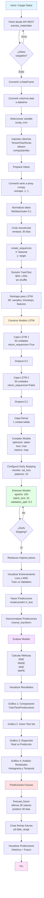

```mermaid
flowchart TD
    A[Inicio: Cargar Datos] --> B[Fetch desde API REST<br/>precios_materiales]
    B --> C{¿Datos<br/>cargados?}
    C -->|Error| B
    C -->|Éxito| D[Convertir a DataFrame]
    D --> E[Convertir columna date<br/>a datetime]
    E --> F[Seleccionar variable<br/>scrap_mxn]
    
    F --> G[Importar Librerías<br/>TensorFlow/Keras<br/>sklearn<br/>numpy/pandas]
    
    G --> H[Preparar Datos]
    H --> I[Convertir serie a array numpy<br/>reshape -1, 1]
    I --> J[Normalizar datos<br/>MinMaxScaler 0-1]
    J --> K[Crear secuencias<br/>ventana: 30 días]
    K --> L[create_sequences<br/>X: features<br/>y: target]
    
    L --> M[División Train/Test<br/>80% / 20%<br/>sin shuffle]
    M --> N[Reshape para LSTM<br/>3D: samples, timesteps, features]
    
    N --> O[Construir Modelo LSTM]
    O --> P[Capa LSTM 1<br/>50 unidades<br/>return_sequences=True]
    P --> Q[Dropout 0.2]
    Q --> R[Capa LSTM 2<br/>50 unidades<br/>return_sequences=False]
    R --> S[Dropout 0.2]
    S --> T[Capa Dense<br/>1 unidad salida]
    
    T --> U[Compilar Modelo<br/>optimizer: adam<br/>loss: mse<br/>metrics: mae]
    
    U --> V[Configurar Early Stopping<br/>monitor: val_loss<br/>patience: 10]
    V --> W[Entrenar Modelo<br/>epochs: 100<br/>batch_size: 32<br/>validation_split: 0.2]
    
    W --> X{¿Early<br/>Stopping?}
    X -->|Sí| Y[Restaurar mejores pesos]
    X -->|No| W
    
    Y --> Z[Visualizar Entrenamiento<br/>Loss y MAE<br/>Train vs Validation]
    
    Z --> AA[Hacer Predicciones<br/>model.predict X_test]
    AA --> AB[Desnormalizar Predicciones<br/>inverse_transform]
    
    AB --> AC[Evaluar Modelo]
    AC --> AD[Calcular Métricas<br/>MSE<br/>RMSE<br/>MAE<br/>MAPE]
    
    AD --> AE[Visualizar Resultados]
    AE --> AF[Gráfico 1: Comparación<br/>Train/Test/Predicciones]
    AF --> AG[Gráfico 2: Zoom Test Set]
    AG --> AH[Gráfico 3: Dispersión<br/>Real vs Predicción]
    AH --> AI[Gráfico 4: Análisis Residuales<br/>Histograma y Temporal]
    
    AI --> AJ[Predicciones Futuras]
    AJ --> AK[forecast_future<br/>últimos 30 valores<br/>predecir 30 días]
    AK --> AL[Crear fechas futuras<br/>pd.date_range]
    AL --> AM[Visualizar Predicciones<br/>Histórico + Futuro]
    
    AM --> END[Fin]
    
    style A fill:#e1f5ff
    style END fill:#ffe1f5
    style O fill:#fff4e1
    style W fill:#e1ffe1
    style AC fill:#f4e1ff
    style AJ fill:#ffe1e1
```